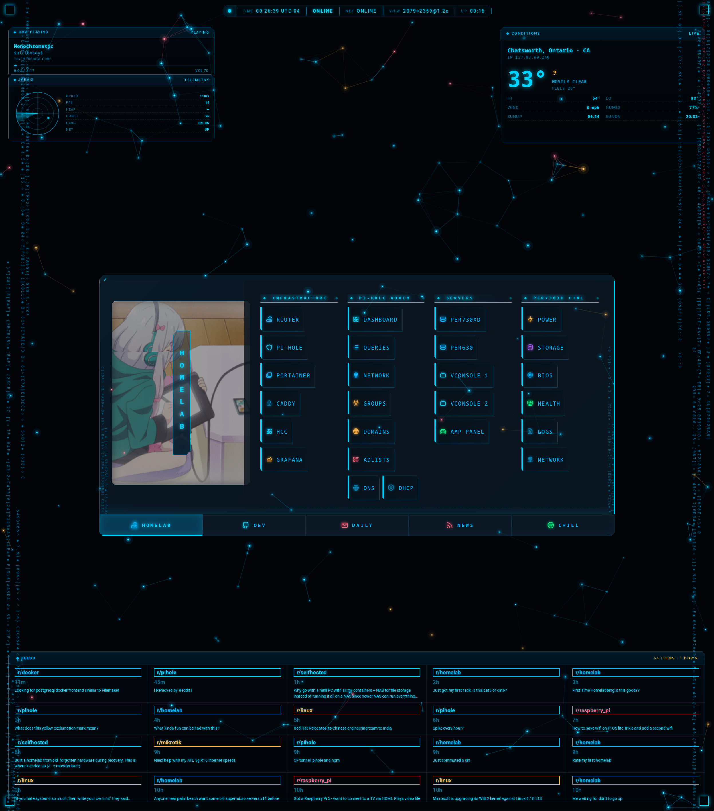

<h1 align="center">
  HCC Startpage
</h1>

<p align="center">
  <b>Cyberpunk command center for the homelab</b><br>
  <a href="https://xbc4000.github.io">xbc4000.github.io</a>
</p>

<p align="center">
  
  
  
  
</p>

<p align="center">
  
</p>

---

A personal browser homepage / new-tab dashboard built for navigating a homelab.
Full HCC ("Homelab Command Center") cyberpunk aesthetic — cyan/magenta/amber
accents, scanline overlay, neural-network particle field, hex data rain, HUD
corner brackets, spinning reactor rings, and a top-center status readout showing
**real** browser + LAN telemetry.

## Features

### 5 Tabs

| Tab | What's in it |
|-----|-------------|
| **HOMELAB** | Infrastructure, Pi-hole admin, servers, iDRAC deep links, Grafana boards, monitoring exporters, network docs, repos |
| **DEV** | GitHub, AI tools, docs (MDN, Docker, Caddy), Linux distro resources, dev tools, tech feeds |
| **DAILY** | Mail, calendar, notes, todos, weather, finance |
| **NEWS** | Tech, Linux, aggregators, world news, subreddits |
| **CHILL** | Music, video, gaming, social, anime, shopping |

### 7 Widgets

| Widget | Position | What it does |
|--------|----------|-------------|
| **HUD Status Bar** | Top center | Pulse dot, UTC clock, LAN/NET status, viewport, uptime |
| **NOW PLAYING** | Top left | Live Spotify track via same-origin bridge proxy (`/bridge/status`) |
| **JARVIS** | Below NOW PLAYING | Radar canvas with probe blips + browser telemetry grid |
| **CONDITIONS** | Top right | Weather via Open-Meteo (keyless), geolocation via BigDataCloud |
| **FEEDS** | Bottom | Live Reddit + HN posts from 9 subreddits + Algolia |
| **Particle Field** | Background | Neural-network canvas — 40-180 nodes with connections |
| **Hex Rain** | Panel edges | Falling hex characters along left/right borders |

### Effects

- Full-viewport scanline + vignette overlay
- Animated scan line (6s sweep)
- Spinning reactor ring accents at panel corners
- Panel hex rain borders
- HUD corner brackets at viewport corners
- Cut-corner clip-paths on panels, links, and widgets

## Configure

Everything user-facing lives in [`userconfig.js`](userconfig.js):

```js
tabs: [
  { name: "HOMELAB", background_url: "src/img/banners/banner_03.gif",
    categories: [
      { name: "infrastructure", links: [
        { name: "router", url: "http://router.home", icon: "router", icon_color: hcc.cyan },
        // ...
      ]},
    ]},
  // ...
]
```

- **Palette** — HCC cyan tokens at the top of the file
- **Tabs / categories / links** — add, remove, reorder
- **Search engines** — `p` Perplexity, `d` DuckDuckGo, `g` Google (press `s` to open)
- **Weather location** — city name for Open-Meteo
- **Clock** — format string, additional timezones via IANA names
- **Icons** — [Tabler Icons](https://tabler.io/icons), class pattern `ti ti-<name>`

## Run locally

Static site, no build step:

```bash
python3 -m http.server 8000
# http://localhost:8000
```

Or serve via Caddy / nginx / anything. Deployed via GitHub Pages from `main`.

### LAN deployment (optional)

Serve from a local box for same-origin API proxying:

```bash
# On your server (e.g., RPi)
git clone git@github.com:xbc4000/xbc4000.github.io.git /var/www/startpage

# Caddy reverse proxy example
startpage.home {
    handle_path /bridge/* {
        reverse_proxy localhost:3081
    }
    handle {
        root * /var/www/startpage
        file_server
    }
}
```

## Project layout

```
index.html                  Entry point — loads scripts in order
userconfig.js               Your config (tabs, palette, links)
userconfig.example.js       Original schema reference
src/
 common/
  effects.js                Particles, rain, HUD chrome, corner brackets
  component.js              Shadow DOM web component base class
  config.js                 Config proxy with localStorage persistence
  palette.js                Catppuccin palette (base layer)
  module.js                 Component registration
 components/
  tabs/                     Main panel — tab switcher, link grid, banner
  conditions/               Weather widget (Open-Meteo + BigDataCloud)
  nowplaying/               Spotify NOW PLAYING (bridge proxy)
  jarvis/                   Radar + telemetry widget
  feeds/                    Reddit + HN live feed
  weather/                  Legacy weather (kept for compatibility)
  clock/                    Clock with timezone support
  statusbar/                HUD status bar
  search/                   Search overlay (multi-engine)
 css/                       Stylesheets, tabler icons
 fonts/                     Local fonts (no Google CDN)
 img/
  banners/                  Tab background images (18 GIFs)
  screenshot.png            Repo screenshot
```

## Credits

Started as a fork of
[**pivoshenko/catppuccin-startpage**](https://github.com/pivoshenko/catppuccin-startpage)
(based on [b-coimbra/dawn](https://github.com/b-coimbra/dawn)). The original
component pattern and file layout come from there.

Color roots in [**Catppuccin**](https://catppuccin.com/palette) — the palette
still loads as a base in `src/common/palette.js`, though the HCC theme overrides
everything with cyan/magenta/amber.

**What's new in this fork:**

- Full cyberpunk visual overhaul (HCC theme)
- 7 live widgets (NOW PLAYING, JARVIS, CONDITIONS, FEEDS, HUD, particles, rain)
- 5 homelab-focused tabs with deep links to every service
- Neural particle field + hex data rain effects engine
- Local font bundling (zero external CDN hits)
- Shadow DOM components with synchronous render (no flash)
- Same-origin Caddy proxy for widget API calls

## License

[MIT](LICENSE) — original catppuccin-startpage codebase + HCC modifications.
