<div align="center">

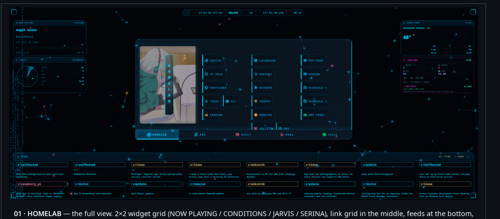

# HCC STARTPAGE

**Cyberpunk command-center browser homepage for a homelab.**

5 tabs · 2×2 live-widget grid · Spotify + weather + AI + radar · neural-network particle field · hex data rain · HUD chrome · shadow-DOM components · zero build step · [xbc4000.github.io](https://xbc4000.github.io)

[](#)
[](#)
[](#)
[](https://xbc4000.github.io)
[](#)


</div>

---

## Gallery

<table>
<tr>
<td align="center" colspan="2">
<a href="docs/screenshots/01-hero.png"></a><br>
<sub><b>01 · HOMELAB</b> — the full view. 2×2 widget grid (NOW PLAYING / CONDITIONS / JARVIS / SERINA), link grid in the middle, feeds at the bottom, HUD bar pinned top-centre.</sub>
</td>
</tr>
<tr>
<td align="center" width="50%">
<a href="docs/screenshots/07a-widgets-left.png">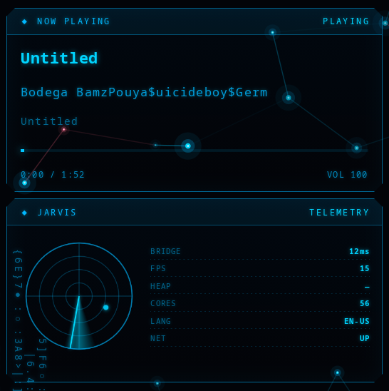</a><br>
<sub><b>Left column</b> — NOW PLAYING (Spotify bridge) over JARVIS (radar + browser telemetry).</sub>
</td>
<td align="center" width="50%">
<a href="docs/screenshots/07b-widgets-right.png">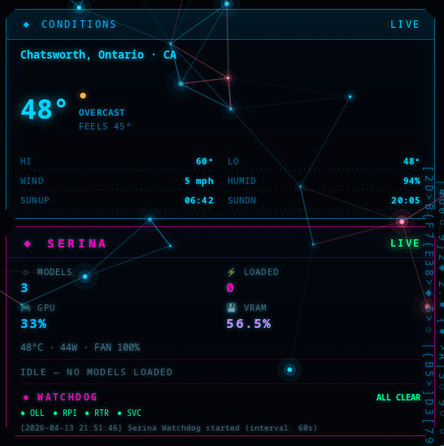</a><br>
<sub><b>Right column</b> — CONDITIONS (Open-Meteo + geo) over SERINA (Ollama + GPU + watchdog).</sub>
</td>
</tr>
<tr>
<td align="center" colspan="2">
<a href="docs/screenshots/09-feeds.png">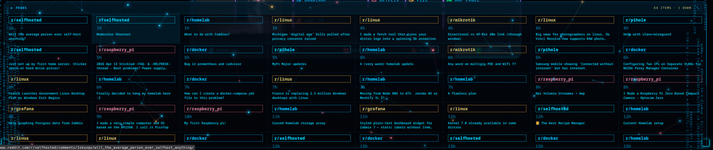</a><br>
<sub><b>FEEDS</b> — live Reddit (9 subreddits) + Hacker News Algolia, auto-refreshing across a multi-column grid.</sub>
</td>
</tr>
<tr>
<td align="center" width="50%">
<a href="docs/screenshots/03-dev.png">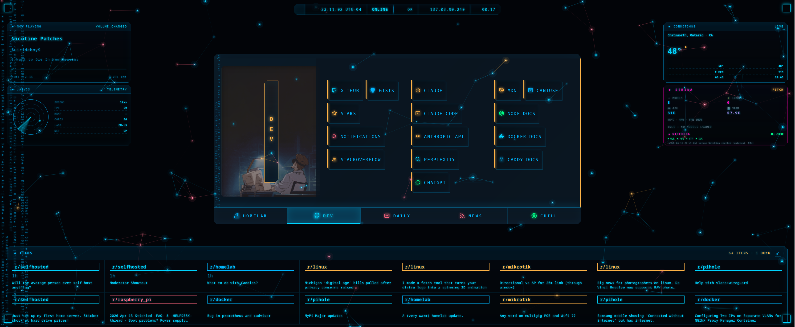</a><br>
<sub><b>DEV</b> — GitHub + AI tools + docs (MDN / Docker / Caddy) + distro resources.</sub>
</td>
<td align="center" width="50%">
<a href="docs/screenshots/04-daily.png">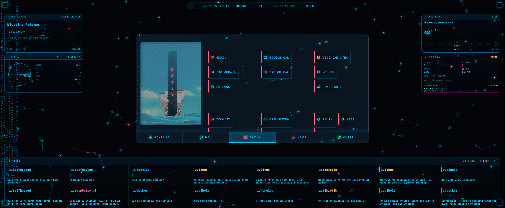</a><br>
<sub><b>DAILY</b> — mail, calendar, notes, todos, weather, finance.</sub>
</td>
</tr>
<tr>
<td align="center" width="50%">
<a href="docs/screenshots/05-news.png">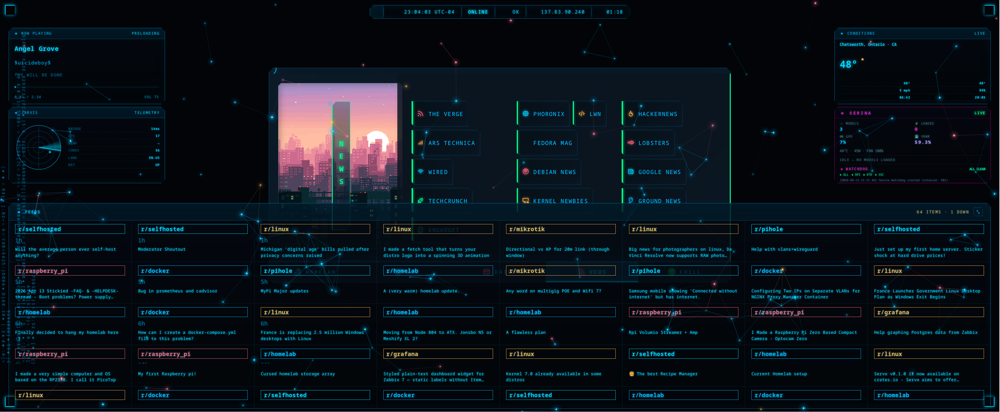</a><br>
<sub><b>NEWS</b> — tech / Linux aggregators, world news, subreddit deep links.</sub>
</td>
<td align="center" width="50%">
<a href="docs/screenshots/06-chill.png">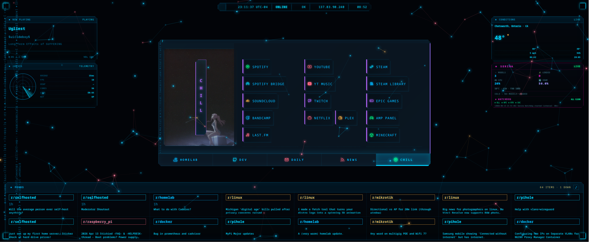</a><br>
<sub><b>CHILL</b> — music, video, gaming, social, anime, shopping.</sub>
</td>
</tr>
<tr>
<td align="center" width="50%">
<a href="docs/screenshots/08-search.png">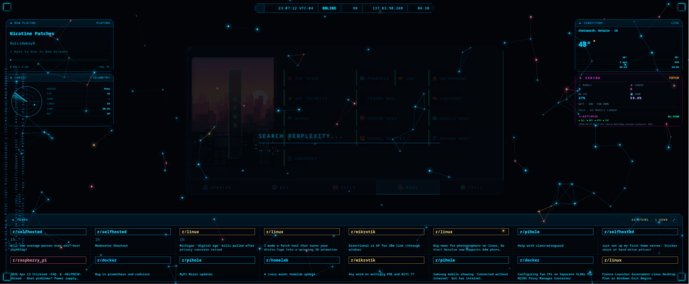</a><br>
<sub><b>Search</b> — press <code>s</code>, pick an engine (<code>p</code> Perplexity / <code>d</code> DDG / <code>g</code> Google), type, go.</sub>
</td>
<td align="center" width="50%">
<a href="docs/screenshots/02-homelab.png">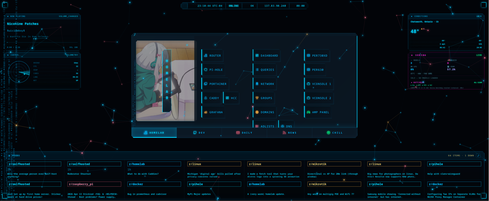</a><br>
<sub><b>HOMELAB tab</b> — deep links to every service (router, Pi-hole, iDRAC, Grafana, Portainer, exporters).</sub>
</td>
</tr>
</table>


---

## What it is

A personal browser new-tab / homepage built for navigating a homelab. Full HCC ("Homelab Command Center") cyberpunk aesthetic — cyan / magenta / amber accents, scanline overlay, neural-network particle field, hex data rain, HUD corner brackets, spinning reactor rings, and a top-centre status bar showing **real** browser + LAN telemetry.

Zero build step. No framework. Pure HTML/CSS/JS with shadow-DOM web components. Runs cold from `python3 -m http.server` or GitHub Pages.

---

## The 5 Tabs

| Tab | What's in it |
|-----|-------------|
| **HOMELAB** | Infrastructure, Pi-hole admin, servers, iDRAC deep links, Grafana boards, monitoring exporters, network docs, repos |
| **DEV** | GitHub, AI tools (`chat.home`, Claude, etc.), docs (MDN, Docker, Caddy), Linux distro resources, dev tools, tech feeds |
| **DAILY** | Mail, calendar, notes, todos, weather, finance |
| **NEWS** | Tech, Linux aggregators, world news, subreddit deep links |
| **CHILL** | Music, video, gaming, social, anime, shopping |

Each tab has its own GIF background banner (18 total, swappable via `userconfig.js`).

---

## The Widgets

Pinned corners in a 2×2 layout (top-left / top-right / bottom-left / bottom-right), each an independent shadow-DOM component with its own polling cadence.

| Widget | Source | What it shows |
|---|---|---|
| **NOW PLAYING** | `/bridge/status` (Caddy proxy → [hcc-spotify-bridge](https://github.com/xbc4000/hcc-spotify-bridge)) | Live Spotify track, album art, progress, device — same-origin fetch, no Spotify Web API |
| **CONDITIONS** | Open-Meteo + BigDataCloud | Temperature, condition, wind, UV, sunrise/sunset; keyless APIs, geolocation once on load |
| **JARVIS** | Browser APIs + LAN probes | Radar canvas with probe blips, viewport/connection/battery/memory/cores/latency grid |
| **SERINA** | `/ollama/status` + `/ollama/serina` (Caddy proxy → [homelab-network](https://github.com/xbc4000/homelab-network)/`ollama-exporter.py`) | Ollama health, GPU temp/VRAM/power/fan, models loaded, watchdog dots, last log line — magenta-themed to mark her as the AI in the stack |

Plus three ambient pieces:

| | What |
|---|---|
| **HUD Status Bar** | Pulse dot, UTC clock, LAN/NET pills, viewport, uptime — pinned top-centre |
| **FEEDS** | Bottom panel, live Reddit (9 subreddits) + HN Algolia, auto-refresh |
| **Particle / Hex Rain** | Background neural-network canvas (40–180 nodes with connections) + falling hex characters along panel edges |

---

## Effects

- Full-viewport **scanline + vignette** overlay
- Animated **scan sweep** (6s cycle)
- Spinning **reactor ring** accents at panel corners
- **HUD corner brackets** at viewport corners
- **Cut-corner clip-paths** on panels, links, widgets
- **Hex rain** along panel edges (left/right borders)
- **Neural particle field** with inter-node connection lines

All effects are `pointer-events: none` overlays at low z-index — they never interfere with input.

---

## Architecture

<div align="center">
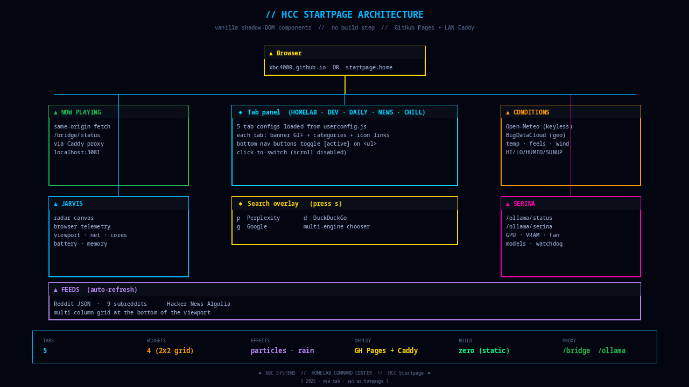
</div>

<sub>Regenerate with <code>python3 scripts/generate-architecture.py</code>.</sub>

### ASCII breakdown

```
Browser  (https://xbc4000.github.io  OR  https://startpage.home/)
|
+-- index.html  (loads components, runs effects, hydrates widgets)
|
+-- Shadow-DOM components  (no framework, no build)
|     tabs/           category + link grid, banner swapping
|     statusbar/      HUD pills (clock, viewport, uptime, net)
|     nowplaying/     fetches /bridge/status every 5s
|     conditions/     Open-Meteo + BigDataCloud (keyless)
|     jarvis/         radar canvas + browser telemetry grid
|     ollama/         Serina widget — /ollama/status + /ollama/serina
|     feeds/          Reddit JSON + HN Algolia
|     search/         overlay, 'p'/'d'/'g' engine switch
|     clock/          multi-timezone clock
|
+-- Effects engine  (src/common/effects.js)
|     particle field · hex rain · scan sweep · HUD chrome
|
+-- Local Caddy deployment (startpage.home vhost on RPi)
      /bridge/*  --> localhost:3081  (hcc-spotify-bridge)
      /ollama/*  --> 10.10.10.2:9401 (ollama-exporter / Serina)
      /          --> /var/www/startpage  (this repo, git-pulled)

GitHub Pages deployment (xbc4000.github.io)
      Widgets requiring a LAN proxy (NOW PLAYING, SERINA) show
      fallback states — they're LAN-only by design.
```

---

## Configure

Everything user-facing lives in [`userconfig.js`](userconfig.js):

```js
tabs: [
  { name: "HOMELAB", background_url: "src/img/banners/banner_03.gif",
    categories: [
      { name: "infrastructure", links: [
        { name: "router",    url: "http://router.home",   icon: "router",    icon_color: hcc.cyan },
        { name: "pi-hole",   url: "http://pi.hole/admin", icon: "shield-x",  icon_color: hcc.red },
        // ...
      ]},
    ]},
  // ...
]
```

- **Palette** — HCC cyan / magenta / amber tokens at the top of the file
- **Tabs / categories / links** — add, remove, reorder freely
- **Search engines** — `p` Perplexity, `d` DuckDuckGo, `g` Google (press `s` to open)
- **Weather location** — city name for Open-Meteo
- **Clock** — format string, additional timezones via IANA names
- **Icons** — [Tabler Icons](https://tabler.io/icons), class pattern `ti ti-<name>`

---

## Run

### GitHub Pages
Already deployed — hit [xbc4000.github.io](https://xbc4000.github.io).

### Locally
```bash
git clone git@github.com:xbc4000/xbc4000.github.io.git
cd xbc4000.github.io
python3 -m http.server 8000
# http://localhost:8000
```

### LAN (startpage.home) — unlocks NOW PLAYING + SERINA widgets
```bash
# On your server (e.g., RPi)
git clone git@github.com:xbc4000/xbc4000.github.io.git /var/www/startpage
```

Caddy vhost:
```caddy
startpage.home {
    handle_path /bridge/* {
        reverse_proxy localhost:3081           # hcc-spotify-bridge
    }
    handle_path /ollama/* {
        reverse_proxy 10.10.10.2:9401 {        # ollama-exporter (Serina)
            flush_interval -1
        }
    }
    handle {
        root * /var/www/startpage
        file_server
        header Cache-Control "no-store, no-cache, must-revalidate, max-age=0"
    }
}
```

Refresh content: `git pull` in `/var/www/startpage` — no restart needed.

---

## Project layout

```
index.html                   Entry — loads components in order
userconfig.js                Your config (tabs, palette, links)
userconfig.example.js        Schema reference
src/
  common/
    effects.js               Particles / rain / HUD / scan sweep
    component.js             Shadow-DOM base class
    config.js                Config proxy + localStorage persistence
    palette.js               Catppuccin palette (overridden by HCC)
    module.js                Component registration
  components/
    tabs/                    Tab switcher + link grid + banner
    statusbar/               HUD status bar
    nowplaying/              Spotify (bridge proxy)
    conditions/              Weather (Open-Meteo + BigDataCloud)
    jarvis/                  Radar + browser telemetry
    ollama/                  Serina widget (homelab AI)
    feeds/                   Reddit + HN feeds
    weather/                 Legacy weather (kept)
    clock/                   Multi-timezone clock
    search/                  Search overlay
  css/                       Stylesheets + tabler icons
  fonts/                     Bundled (no Google CDN)
  img/
    banners/                 18 tab background GIFs
    screenshot.png           Legacy screenshot
docs/
  screenshots/               Gallery (see that dir's README)
  CLOCK.md                   Clock config notes
```

---

## Credits

Started as a fork of [**pivoshenko/catppuccin-startpage**](https://github.com/pivoshenko/catppuccin-startpage) (based on [b-coimbra/dawn](https://github.com/b-coimbra/dawn)). The original component pattern and file layout come from there.

Colour roots in [**Catppuccin**](https://catppuccin.com/palette) — the palette still loads as a base in `src/common/palette.js`, though the HCC theme overrides everything with cyan / magenta / amber.

### What's new in this fork
- Full cyberpunk HCC visual overhaul
- 2×2 live-widget grid, including **Serina** (homelab AI status)
- 5 homelab-focused tabs with deep links to every service
- Neural particle field + hex data rain effects engine
- Local font bundling (zero external CDN hits)
- Shadow-DOM components with synchronous render (no flash)
- Same-origin Caddy proxy for widget API calls (LAN deployment)

---

<div align="center">

<a href="https://www.techxmaestro.com">
  <picture>
    <source media="(prefers-color-scheme: dark)" srcset="https://raw.githubusercontent.com/xbc4000/homelab-network/main/assets/branding/techx-maestro.png">
    
  </picture>
</a>

<sub><b>HCC</b> (Homelab Command Center) is a product of <a href="https://www.techxmaestro.com"><b>TechX Maestro</b></a>.</sub>

<sub>HCC repos · <a href="https://github.com/xbc4000/hcc-dashboard">hcc-dashboard</a> · <a href="https://github.com/xbc4000/hcc-spotify-bridge">hcc-spotify-bridge</a> · <a href="https://github.com/xbc4000/homelab-network">homelab-network</a></sub>

</div>

## License

[MIT](LICENSE) — original catppuccin-startpage codebase + HCC modifications.
